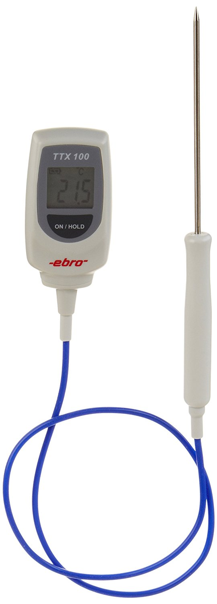

---
output:
  html_document: default
  pdf_document: default
---

```{r packages, echo=FALSE}
library(knitr)
library(pander)
library(tidyverse)
```

# Acquisition des données

## Recommandations générales

Cette première partie du guide doit être lue comme une proposition d'organisation chronologie de chaque étape à accomplir pour l'acquisition de données de terrain : avant (section \@ref(avant)), pendant (section \@ref(pendant)) et après (section \@ref(apres)) les relèves. Dans chacune de ces parties se trouvent des renvois vers les détails de chaque procédure. Il faut ensuite revenir au point qui était en cours de traitement pour ne pas oublier d'étape.

------------------------------------------------------------------------

De manière générale, il semble qu'un certain nombre de difficultés puissent être évitées en suivant quelques recommandations assez simples :

- Travailler le plus possible avec **toujours le même ordinateur**, afin d'éviter les mélanges de réglage d'horloge.
- Bien veiller à **synchroniser l'horloge de la navette** avec celle de l'ordinateur, afin d'éviter les mélanges de réglage d'horloge.
- Ne pas hésiter à **changer les piles régulièrement** (des capteurs comme de la navette), afin qu'elles aient toujours un niveau supérieur à 50 ou 60 %. Il vaut mieux changer une pile que perdre plusieurs mois de données et le travail associé.

------------------------------------------------------------------------

## Aide-mémoire chronologique {#chronologie}

### Avant {#avant}

- Vérifier que le matériel nécessaire est prêt et disponible (voir liste globale en \@ref(materiel)) :

    - Charger l'ordinateur et le GPS
    - Vérifier s'il reste des tubes de protection et des lests d'avance

- Lancer des sondes à l'avance (voir section \@ref(lancementsonde))

- Vérifier si l'horloge de la navette est bien synchronisée et les piles ok (voir section \@ref(lancementnavette))

- Imprimer la dernière version de l'atlas

- Imprimer le dernier état des stations, avec notamment les tâches à réaliser

- Faire le point sur les opérations notées à réaliser sur chaque station à partir de la tournée précédente et préparer le matériel nécessaire en fonction

- Vérifier les débits (<http://www.rdbrmc.com/hydroreel2/listestation.php?dep=39>)

### Pendant {#pendant}

- Calendrier :

    - Si deux tournées annuelles : au cours des mois d'avril et d'octobre
    - Si trois tournées annuelles : au cours des mois de février-mars, de mai-juin et d'octobre

- Tournée à organiser géographiquement en fonction de l'atlas

- Au niveau de chaque station :

    - Localiser la sonde
    - Placer le thermomètre manuel
    - Nettoyer la sonde en place
    - La brancher dans la navette et faire le transfert (voir section \@ref(utilisationnavette))
    - Noter sur le cahier de suivi la station (selon le code de l'atlas), la date, l'heure, les mesures manuelles de température et de hauteur d'eau entre la surface et le capteur, l'opérateur, etc.
    - Noter les éventuelles corrections à apporter sur l'atlas

### Après {#apres}

- Traitement des données :

    - Saisies des données de description des stations (si installation de nouvelles stations) (voir section \@ref(saisiestations))
    - Scan/photocopie du cahier de suivi pour les dernières opérations et transmission
    - Saisie des données de suivi des stations (voir section \@ref(saisiesuivi))
    - Vidange des données de la navette (voir section \@ref(vidangenavette)) et/ou des sondes défectueuses
    - Transmission des fichiers (voir section \@ref(envoisuivi))

- Arrêter les sondes non utilisées (voir section \@ref(arretsonde))

- Remettre le matériel en état (changement des piles, des boîtiers, etc.)

- Commander le matériel manquant pour la prochaine tournée.

## Saisie

L'objectif de ce chapitre est de préciser les formats de saisie des informations au sein des champs contenus dans les fichiers "modèles" de rendu des données. L'objectif est que tous les acteurs travaillent avec ces mêmes formats, facilitant alors le stockage, la transmission et le traitement de ces résultats.

Une première partie traite des données relatives aux **stations**, puis celles relatives aux **suivis de terrain** et aux éventuels **commentaires** annuels des chroniques, puis enfin les **différents fichiers à transmettre** suite à une campagne de terrain.

### Saisie des caractéristiques des stations {#saisiestations}

- Complément sur le terrain des informations de la station sur la fiche [recto](https://github.com/jbfagotfede39/notice-thermie/raw/master/data/Stations/Fiche_pose_sonde_thermique_simple.pdf) ou [recto-verso](https://github.com/jbfagotfede39/notice-thermie/raw/master/data/Stations/Fiche_pose_sonde_thermique_double.pdf)

- Saisie des informations de terrain concernant les stations dans le [fichier excel](https://github.com/jbfagotfede39/notice-thermie/raw/master/data/Stations/Saisie_stations_chroniques.xlsx) (ou [cette version plus large](https://github.com/jbfagotfede39/notice-thermie/raw/master/data/Stations/Saisie_stations_chroniques_avec_champs_complementaires.xlsx) pour les collectivités extérieures au département et souhaitant générer les fiches atlas de résultats, avec complément des champs adéquats : `chsta_distancesource`, `chsta_typetheorique`, `chsta_altitude`, `chsta_codecontextepdpg` et `chsta_sprep` - séparer les codes espèces par des virgules : `TRF,CHA,OBR`).

- Complément des différents champs :

    - `chsta_coderhj` : code d'identification de la station propre au RSTMAJ. **Laisser vide**
    - `chsta_codemo` : code d'identification de la station propre à chaque maître d'ouvrage
    - `chsta_codesie` : si la station possède un code dans le SIE de l'AERMC
    - `chsta_mo` : Nom du maître d'ouvrage : `OFB`, `CD39_CR_Ain`, `CD39_RDM`, `DREAL`, `FJPPMA`, `PNRHJ`, `SMDL`, `SR3A`
    - `chsta_milieu` : Nom de l'écosystème (cours d'eau ou plan d'eau)
    - `chsta_coord_x` et chsta_coord_y : Coordonnées précises de la sonde en **Lambert 93**
    - `chsta_fonctionnement` : `En cours` ou `Arrêté`
    - `chsta_transmission` : `Oui` si télétransmission, sinon `Non`
    - `chsta_suivithermie` : `Oui`
    - `chsta_reseauthermietype` : `Patrimonial` ou `Opérationnel`
    - `chsta_suivipiezo` : `Non`
    - `chsta_suivihydro` : `Non`
    - `chsta_suivio2` : `Non`
    - `chsta_suivipluvio` : `Non`
    - `chsta_codehydro` : code de la station hydrométrique associée (si pertinent)
    - `chsta_codemeteofrance` : code de la station Météo-France associée
    - `chsta_distancesource` : distance à la source, en km
    - `chsta_typetheorique` : type théorique selon la typologie de Verneaux : `1.5`, `3`, etc.
    - `chsta_altitude` : altitude, en mètres
    - `chsta_codecontextepdpg` : Identifiant du contexte PDPG local
    - `chsta_sprep` : Espèce(s) piscicole(s) repère(s), à séparer par des virgules : `TRF,CHA,OBR`
    - `chsta_largeurlitmineur` : largeur du lit mineur, en mètres
    - `chsta_largeurlitetiage` : largeur du lit d'étiage, en mètres
    - `chsta_rive` : rive d'ancrage de la sonde (RD, RG)
    - `chsta_ancrage` : support d'ancrage de la sonde
    - `chsta_acces` : modalités d'accès au secteur
    - `chsta_detailsloc` : détails de localisation
    - `chsta_description` : description du dispositif, si nécessaire
    - `chsta_ordretournee` : position dans l'ordre de la tournée de relève du maître d'ouvrage, si nécessaire
    - `chsta_impacts` : présence d'impacts potentiels sur la thermie (étang/seuil à l'amont, etc.)
    - `chsta_infl_ant_type` : type d'impacts/influence anthropiques potentiels sur la thermie (étang/seuil à l'amont, rejets, chenalisation, etc.), en lien avec le champ `chsta_impacts` ci-dessus
    - `chsta_infl_nappe` : éventuelle influence de la nappe sur la station (`Oui`/`Non`)
    - `chsta_profsonde` : profondeur d'eau sous la sonde à l'étiage, en mètres
    - `chsta_substrats` : substrat en présence sous la sonde (FIN, GAL, GRA, etc.)
    - `chsta_distberge` : distance à la berge, en mètres
    - `chsta_ombrage` : importance relative de l'ombrage à l'endroit où la sonde a été placée : TF = Très Faible ; F = Faible ; M = Moyen ; I = Important ; TI = Très Important
    - `chsta_facies` : faciès d''écoulement dans lequel la sonde a été placée : RAD = radier/rapide ; PLC= plat courant ; PLT = plat lent ; CHELOT = chenal lotique ; CHELENT = chenal lentique ; MOU = mouille/fosse
    - `chsta_numphoto` : Nom du fichier de la photographie de l'emplacement de la sonde, annoté si besoin
    - `chsta_zcapteur` : **Laisser vide**
    - `chsta_zbouchon` : **Laisser vide**
    - `chsta_typez` : **Laisser vide**
    - `chsta_hcapteurbouchon` : **Laisser vide**
    - `chsta_remarques` : éventuelles remarques sur la station


### Saisie des suivis de relève {#saisiesuivi}

- Afin de constituer un "cahier de terrain", impression et reliure de [ce document](https://github.com/jbfagotfede39/notice-thermie/raw/master/data/Suivi_terrain/Fiches_suivi_terrain_chronique.pdf)

- Saisie des informations de suivi de terrain dans le [fichier excel](https://github.com/jbfagotfede39/notice-thermie/raw/master/data/Suivi_terrain/Saisie_suivi_terrain_chronique.xlsx)

- **Créer deux lignes en cas de remplacement d'une sonde** : une ligne avec l'ancien numéro de sonde, une avec le nouveau, toutes les autres données étant identiques.

- Dans le cas d'une sonde disparue, bien compléter le numéro de sonde en allant vérifier celui noté lors de la dernière relève

- Complément des différents champs :

    - chsvi_mo : Nom du maître d'ouvrage
    - chsvi_operateurs : nom des opérateurs le jour de l'intervention
    - chsvi_coderhj : code de la station fourni par le RSTMAJ. Pas d'espace : tous les caractères doivent être accolés.
    - chsvi_date : date de l'intervention, format `2015-10-07` pour le 7 octobre 2015
    - chsvi_heure : heure d'intervention, format `09:35:00`
    - chsvi_capteur : numéro du capteur
    - chsvi_valeur : température relevée avec un thermomètre manuel
    - chsvi_profondeur : hauteur d'eau entre la surface et la sonde au moment de la relève, en mètres
    - chsvi_action : Relève, Pose, Dépose, Disparue **(si on effectue un remplacement, saisir deux lignes pour la même station** : une en dépose avec le numéro du capteur enlevé, une en pose avec le numéro du capteur remis en place, avec les mêmes dates, heures et autres paramètres). Dans le cas d'une **sonde disparue**, bien compléter le numéro de sonde en allant **vérifier celui noté lors de la dernière relève**.
    - chsvi_fonctionnement : si l'opération s'est bien déroulée ou non
    - chsvi_remarques : si des points complémentaires sont à noter
    - chsvi_actionafaire : opérations à effectuer lors du prochain passage.

### Envoi des informations de pose et/ou de suivi {#envoisuivi}

Les envois des données relatives aux différentes situations présentées ci-dessous sont à réaliser vers [jean-baptiste.fagot\@peche-jura.com](mailto:jean-baptiste.fagot@peche-jura.com?subject=%5BRSTMAJ%5D%20Envoi%20données%20thermie), directement en pièce jointe au sein d'une archive (.zip, .rar ou autre) ou à travers une plateforme de transfert (Dropbox, WeTransfer, etc).

- Dans le cas de la **création de nouvelles stations** :

    - Scan des fiches de description de terrain (.pdf)
    - Fichier de saisie de la description des stations (.xlsx)
    - Photographies des stations, avec comme noms de fichiers ceux indiqués dans la colonne "chsta_numphoto" (.png ou .jpg)
    - Fichier de saisie des informations de suivi, avec "Pose" dans la colonne "Action" (.xlsx)

- Dans le cas d'un **suivi courant** :

    - Scan des fiches de suivi de terrain (.pdf)
    - Fichier de saisie du suivi de terrain (.xlsx)
    - Correction à apporter sur l'atlas : scan des pages annotées à la main (.pdf)
    - **UNIQUEMENT POUR LES COLLECTIVITÉS DANS LE DÉPARTEMENT DU JURA** : Fichiers natifs issus des sondes et/ou de la navette (.hobo), nommés selon la formule suivante : "CodeRHJ_Datederelève_NuméroCapteur", soit par exemple "BIE0-1_2017-10-10_9764347.hobo" si la sonde 9764347 a été relevée le 10 octobre 2017 sur la station BIE0-1.
    - **UNIQUEMENT POUR LES COLLECTIVITÉS HORS DÉPARTEMENT DU JURA** : Fichiers .txt issus des fichiers .hobo cités précédemment (générés à partir de l'exportation décrite en section \@ref(transformation) et selon les paramétrages décrits en section \@ref(parametrage), et nommés selon la même convention : BIE0-1_2017-10-10_9764347.txt (ou station_année.txt, exemple Combe-lavaux_2016.txt). **Il est essentiel que tous les fichiers soient homogènes dans leur nommage et dans leur format de données**.

- Dans le cas de l'**arrêt d'une station** :

    - Liste des stations arrêtées.
    - Fichiers cités ci-dessus dans le cas d'un suivi courant.

### Saisie des données relatives aux capteurs {#saisiecapteur}

- Saisie des données relatives aux capteurs dans le [fichier ci-joint](https://github.com/jbfagotfede39/notice-thermie/raw/master/data/Capteurs/Saisie_capteurs_chroniques.xlsx) afin que celles-ci soient réutilisées pour générer les exportations des données au format d'échange AE-OFB. Ce fichier peut également servir à chaque maître d'ouvrage pour la **gestion** de son **parc de capteurs**.

- Les différents champs correspondent aux informations suivantes, avec une ligne par capteur :

    - chcap_proprietaire : Nom du propriétaire du capteur : "OFB", "CD39_CR_Ain", "CD39_RDM", "DREAL", "FDPPMA39", "PNRHJ", "SMDL", "SR3A", etc.
    - chcap_typecapteur : Type de capteur : "Thermie", "Piézométrie", "Oxygène", etc.
    - chcap_modelecapteur : Modèle de capteur : "Hobo UA-001-64", "Hobo U20-001-04", etc.
    - chcap_numerocapteur : Identifiant unique du capteur : "20357972", "N2296", etc.
    - chcap_etat : État actuel du capteur : "OK", "HS", etc.
    - chcap_projet : Éventuel projet de rattachement du capteur : "PDPG", "Étude Bienne", etc.
    - chcap_originecapteur : "Achat", "Remplacement garantie", etc.
    - chcap_datedebut : Date d'acquisition du capteur : format `2013-07-23`
    - chcap_datefin : Éventuelle date de fin de fonctionnement du capteur/mise au rebut : format `2013-07-23`
    - chcap_remarques : Remarques éventuelles à apporter

### Saisie des commentaires des chroniques {#saisiecommentaire}

- Saisie des commentaires des chroniques annuelles dans le [fichier ci-joint](https://github.com/jbfagotfede39/notice-thermie/raw/master/data/Commentaires/Saisie_commentaires_chroniques.xlsx) afin que celles-ci soient réutilisées pour générer les fiches atlas de résultats.

- Les commentaires ne doivent pas dépasser les 600 caractères afin d'être bien affichés au niveau des fiches atlas des résultats.

## Matériel

### Liste générale de matériel {#materiel}

Cette liste est une liste générale de matériel à emporter sur le terrain afin de réaliser des poses/relèves de sondes.

**Localisation**

- **GPS**
- Bombe de peinture
- **Appareil photo**
- **Annuaire de localisation des stations**
- Petit plaque d'identification du dispositif, avec coordonnées de contact

**Installation**

- [**Tubes/manchons de protection**](#descriptionmanchon)
- Colle pour assemblage des tubes
- **Câble inox**
- **Serre-câbles inox**
- **Clé à pipe de 7**
- **Boulon à œil à expansion inox**
- **Clé pour piton**
- **Marteau**
- [**Lests**](#descriptionlest)
- **Pinces coupantes**
- **Perforateur**
- Télémètre ou décamètre
- Pinces universelles

**Gestion**

- **Navette**
- **Brosse à dents**
- [**Thermomètre de terrain**](#thermometre)
- **Sondes de remplacement**
- **Carnet de suivi de terrain des sondes thermiques} + crayon de papier**
- Ordinateur + chargeur
- Lecteur USB
- Piles AA pour la navette (2)
- Piles CR2032 pour sondes
- Petit tournevis plat
- Petit tournevis cruciforme
- Capuchons de rechange
- Papier absorbant/torchon pour essuyer

### Exemples de références du matériel

<p style="text-align: justify;">

Cette section contient les références des principaux matériels utilisés par les opérateurs du département. Il constitue un aide-mémoire et reste néanmoins non-exhaustif.

</p>

#### Matériel Hobo {#hobo}

<p style="text-align: justify;">

La plupart des maîtres d'ouvrage du département utilisent du matériel de la marque Hobo. Ces produits sont commercialisés en France par le revendeur ProSensor (15 rue de Montvaux 57865 Amanvillers - [www.prosensor.com](www.prosensor.com)), représenté par M. Christophe Arnould (07-49-48-76-67 - [carnould\@prosensor.com](mailto:carnould@prosensor.com)). Les références figurant dans le tableau ci-joint sont données à titre indicatif et doivent être confirmées auprès du fournisseur.

</p>

```{r vuemateriel2, echo=FALSE}
# https://stackoverflow.com/questions/50108763/how-to-insert-images-into-table-in-r-markdown
pander::panderOptions('table.split.table', 300) # Pour que tout tienne sur la largeur de la page

tibble::tribble(
        ~Référence, ~Type, ~Vue, ~Détails, ~`Prix approximatif`,
        #"", "",  "" %>% pander::pandoc.image.return(), "", " €",
        "UA-002-08", "Sonde thermique",  "Figures/Materiel/UA-002-08.jpg" %>% pander::pandoc.image.return(), "HOBO Pendant Temp Logger - 8K Plage -20+70°C - Mémoire insuffisante pour mesure horaire sur une saison complète", "",
        "UA-001-64", "Sonde thermique",  "Figures/Materiel/UA-001-64.jpg" %>% pander::pandoc.image.return(), "HOBO Pendant Temp Logger - 64K Plage -20+70°C", "100 € (tarif dégressif si volume > 25)",
        "U22-001", "Sonde thermique",  "Figures/Materiel/U22-001.jpg" %>% pander::pandoc.image.return(), "HOBO Water Temp Pro v2", "",
        "UTB1-001", "Sonde thermique",  "Figures/Materiel/UTBI-001.jpg" %>% pander::pandoc.image.return(), "HOBO Tidbit v2", "",
        "MX2201", "Sonde thermique Bluetooth",  "Figures/Materiel/MX2201.png" %>% pander::pandoc.image.return(), "HOBO Pendant MX Température", "",
        "BASE-U-1", "Base de transfert petit format",  "Figures/Materiel/BASE-U-1.jpg" %>% pander::pandoc.image.return(), "Station de base optique USB pour enregistreur type UA", "75 €",
        "BASE-U-4", "Base de transfert grand format",  "Figures/Materiel/BASE-U-4.jpg" %>% pander::pandoc.image.return(), "Station de base optique USB avec couleurs de différents types", "",
        "U-DTW-1", "Navette",  "Figures/Materiel/U-DTW-1.jpg" %>% pander::pandoc.image.return(), "Navette de transport 4Mo waterproof connection USB étanche 20 mètres", "300 €",
        "BHW -PRO-CD", "Logiciel",  "", "Hoboware pro v3.0.x logiciel pour PC ou Mac avec clé d’enregistrement", "95 €",
        "UA- PARTSKIT", "Boîtier vide",  "Figures/Materiel/UA-PARTSKIT.jpg" %>% pander::pandoc.image.return(), "Boîtier transparent comprenant boîtier, capuchon, vis et joint", "24 €",
        "", "Sachets de dessicant",  "", "", "",
        "HRB TEMP CR2032", "Pile",  "Figures/Materiel/CR2032.jpg" %>% pander::pandoc.image.return(), "Pile CR2032 de remplacement pour UA-001-64 et MX2201", "3,5 €",
        "PORT ET EMBALLAGE", "Transport", "", "", "22 €"
) %>%
  pander()

```

#### Thermomètre de terrain {#thermometre}

<p style="text-align: justify;">

Le thermomètre utilisé par la FJPPMA pour les mesures de terrain est un thermomètre Kern TTX 100 (voir figure \@ref(fig:vuethermometre)). Sa résolution est de 0,1°C, sa plage de mesure allant de -50°C à +350°C. La mesure est réalisée en 5 secondes, il présente 60 cm de fil. Sa valeur est d'environ 100 € TTC. Tout autre modèle peut être utilisé, celui-ci étant présenté à simple titre d'exemple.

</p>

```{r vuethermometre, echo=FALSE, out.width="20%", fig.align="center", fig.cap="Thermomètre Kern TTX 100 (semblable au modèle ebro TTX 200"}

```

#### Quincaillerie {#quincaillerie}

<p style="text-align: justify;">

Différents éléments de quincaillerie peuvent être utilisés. De manière générale, seul de l'inox est conseillé, pas de l'acier galvanisé, qui a tendance à se recouvrir de dépôts calcaires et à devenir cassant :

</p>

- Câble inox, diamètre 3mm (1 à 1,5 mètre en moyenne par point de pose)
- Serre-câble (2 par point de pose)
- Boulon à œil à expansion (1 par point de pose)

#### Tubes/manchons de protection {#descriptionmanchon}

<p style="text-align: justify;">

Les tubes/manchons de protection sont construits à partir d'un assemblage par collage entre un manchon PVC de diamètre 100mm et le tampon de visite qui va avec. La partie supérieure du tampon de visite ne doit pas être collée. Elle doit par contre être percée de deux ou quatre trous, afin d'y faire passer le câble. Le poids de cette protection permet dans la grande majorité des cas une résistance suffisante au courant pour rester au fond. Il est potentiellement utile de percer un trou dans le bas du manchon afin de pouvoir y attacher un lest le cas échéant.

</p>

```{r vuemanchon, echo=FALSE, out.width="20%", fig.align="center", fig.cap="Exemple de manchon de protection"}
knitr::include_graphics('Figures/Materiel/ManchonPVC.jpg')
```

#### Lests {#descriptionlest}

<p style="text-align: justify;">

Il est parfois nécessaire d'ajouter à un ancrage classique en berge ou sur un piton un lest, qui va permettre d'empêcher la sonde de remonter vers la surface au gré de l'hydrodynamique. Des lests propres peuvent être fabriqués en remplissant de béton des morceaux de tube PVC de 150mm de long par 100mm de diamètre et en y plaçant avant la prise du béton, en partie haute et à l'envers, un anneau en U (fer à béton plié, étrier, câble inox), qui servira ensuite de point d'accrochage.

</p>

```{r vuelest, echo=FALSE, out.width="40%", fig.align="center", fig.cap="Exemple de lest"}
knitr::include_graphics('Figures/Materiel/Lest.jpg')
```

#### Matériel de mesure avec télétransmission

<p style="text-align: justify;">

Tout un panel de matériel permettant la télétransmission des données mesurées existe. Hors de toute volonté d'exhaustivité, voici quelques notions de coûts :

</p>

- Modems :

    - Modem pour un unique capteur :

        - Modem GPRS TUBE 300R baro, batterie lithium au format propriétaire, pour In-Situ Rugged/Level TROLL, nécessitant abonnement 4G annexe : 1350 € TTC
        - Modem GPRS TUBE 300S baro, solaire, pour In-Situ Rugged/Level TROLL, nécessitant abonnement 4G annexe : 1600 € TTC
        - Modem nouvelle génération VuLink : 4G LTE (consommation énergétique nettement moindre), 3 piles D alcalines ou lithium, e-SIM intégré dans le modem offre une transmission de 24 points de données par jour : 1025 € TTC

    - Modem pour deux capteurs simultanés :

        - Modem GPRS CUBE 300R ventilé, batterie Lithium, Twist Lock : 2525 € TTC

- Capteurs :

    - Sonde Niv/T° abs. Rugged TROLL 200, gamme 0-9m : 800 € TTC
    - Sonde Niv/T°abs. Level TROLL 400, gamme 0-11m, non ventilé : 1000 € TTC

- Câble de connexion :

    - Rugged Troll :

        - Connecteurs (x2) pour câble Rugged Troll (inclus montage) : 150 € TTC
        - Câble pour Rugged Troll, le mètre : 7,50 € TTC

    - Level Troll :

        - Connecteurs Twist-Lock (x2) pour câble Level Troll (inclus montage) : 220 € TTC
        - Câble non-ventilé pour Level Troll, le mètre : 12,50 € TTC

- Services :

    - Forfait annuel SIM GPRS 2Mo/mois pr modem IN-SITU : 55 € TTC
    - Forfait hébergement et visualisation données sur plateforme HydroVu, 1 modem, 1 an : 275 € TTC

- Outils/interfaces de connexion :

    - Câble adaptateur PC(USB) pour Rugged/Level TROLL : 340 € TTC
    - Adaptateur PC (USB) pr configuration modems Tube/Cube : 170 € TTC
    - TROLL Com Bluetooth (AquaTroll/LevelTroll) pr Android/PC : 670 € TTC

## Fonctionnement du matériel {#fonctionnementmateriel}

### Montage d'ancrage {#montageancrage}

<p style="text-align: justify;">

La **sonde** est placée à l'**intérieur du [tube/manchon de protection](#descriptionmanchon)**, et attachée par au-dessus via un câble (brin libre sortant directement de la bobine) passant dans les trous réalisés et bloqué par un serre-câble. Il est ainsi possible d'accéder à la sonde soit en dévissant la partie supérieure du tampon de visite, soit en insérant le lecteur/la navette directement dans le manchon en PVC (la navette passe généralement avec la main). Il est ainsi possible, pour les opérations courantes de relève, de ne pas avoir à démonter l'ensemble, mais simplement à sortir le manchon de l'eau, utiliser directement la navette puis remettre la sonde à l'eau.

</p>

<p style="text-align: justify;">

Ce montage est ensuite mis en place sur le site de pose en coupant à la longueur adéquate (+ 50 cm) le câble inox. Le **point d'attache en berge** peut être une solide racine de ripisylve autour de laquelle on vient placer une boucle de câble inox à partir du brin libre suite à la découpe. Si aucun point d'accrochage fiable n'est présent en berge, le plus simple est de percer un bloc, une pile de pont, etc. et d'y fixer un boulon à œil à expansion inox, sur lequel on viendra s'attacher. Une petite plaque d'identification du dispositif, sur laquelle figure un contact, peut également être ajoutée sur le câble.

</p>

<p style="text-align: justify;">

Le poids du manchon permet dans la grande majorité des cas une résistance suffisante au courant pour rester au fond, mais l'ajout d'un [**lest**](#descriptionlest) peut s'avérer nécessaire. Dans ce cas, soit repercer un trou dans le bas du manchon (cas idéal), soit attacher le lest directement à partir des trous supérieurs (position penchée de la sonde).

</p>

### Changement de pile {#changementpile}

#### Onset Hobo UA-001-64
- Matériel nécessaire
  * Navette/interface USB permettant la récupération des données
  * Ordinateur
  * Graisse silicone
  * Tournevis cruciforme fin
  * Tournevis plat fin
  * Étiquettes
  
- Organisation
  * Disposer d'un plan de travail assez grand
  * Faire des étiquettes et différents emplacements sur le plan de travail :
    - Piles usagées (1)
    - Piles neuves (2)
    - Sondes HS, changer pile et récupérer les données
    - Sondes avec pile déjà changée, données à vérifier
    - Sondes fonctionnelles, avec pile à changer
    - Sondes fonctionnelles et entretenues
  * Arrêter la sonde et récupérer les données
  * (Relancer la sonde si nécessaire)

- Ouverture/fermeture des sondes
  * Dévisser le boîtier et enlever le bouchon noir en plastique dur
  * Nettoyer le bouchon noir en plastique dur
  * Enlever la plaquette électronique, laisser l'étiquette bleue à l’intérieur
  * Enlever la pile à l'aide du tournevis plat. Point de vigilance : faire attention à ne pas endommager l'antenne
  * Ranger la pile usagée dans le groupe « piles usagées »
  * Installer une pile neuve
  * Remettre la plaquette électronique dans le boîtier (LED côté étroit de la goulotte dans le boîtier plastique)
  * Appliquer une fine couche de graisse silicone sur le joint en caoutchouc du bouchon
  * Fermer le boîtier en veillant à ne pas pincer le joint, et revisser sans excès


```{=html}
<!--- Description ----
### Notices fabricants {#notices}
### Paramétrage de Hoboware Pro {#parametragehobowarepro}
### Mise en fonctionnement d'une sonde {#lancementsonde}
### Vidange d'une sonde {#vidangesonde}
### Arrêt d'une sonde sans vidange {#arretsonde}
### Lancement de la navette {#lancementnavette}
### Utilisation sur le terrain de la navette {#utilisationnavette}
### Vidange de la navette {#vidangenavette}
### Transformation des fichiers hobo {#transformation}
#### Exportation par lot {#exportationlot}
#### Transformation d'un fichier seul {#exportationsimple}
 -->
```
