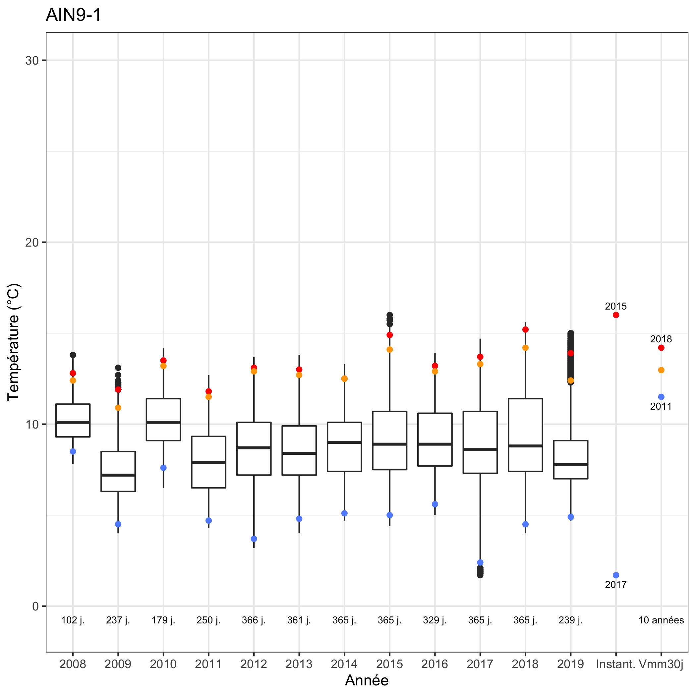

```{r couleurtexte, echo=FALSE}
colorize <- function(x, color) {
  if (knitr::is_latex_output()) {
    sprintf("\\textcolor{%s}{%s}", color, x)
  } else if (knitr::is_html_output()) {
    sprintf("<span style='color: %s;'>%s</span>", color, 
      x)
  } else x
}
```

# Valorisation
Ce chapitre contient les informations utiles à l'utilisation des différentes valorisation générées par l'outil de traitement.

## Suivi de terrain
## Capteurs
## Stations
## Format DCE

## Données agrégées 

## Figures
Différentes figures peuvent être générées à partir des chroniques disponibles. Ces multiples représentations permettent de s'intéresser à différentes thématiques.

### Figures annuelles 

### Figures interannuelles

```{r vueinterannuelleboxplot, echo=FALSE, fig.cap="Exemple de représentation interannuelle de l'Ain à Bourg-de-Sirod (39) - Données DREAL BFC", out.width="80%"}

```
Une vue synthétique de la tendance des températures des dix dernières années sur une même station semble pertinente. La fonction `chronique.figure.interannuelle` permet de générer ce type de figure, dont un exemple est visible sur la figure \@ref(fig:vueinterannuelleboxplot). Différents niveaux d'informations sont contenus dans celle-ci :

- pour chaque année :
    - la distribution des mesures individuelles, sous forme de boxplot (`style = boxplot` - distribution des quartiles et des extremums) ou sous forme d'enveloppe (`style = violon` - distribution continue),
    - le nombre de journées concernée par cette distribution annuelle,
    - la moyenne journalière minimale, sous forme de point `r colorize("bleu", "blue")`,
    - la moyenne journalière maximale, sous forme de point `r colorize("rouge", "red")`,
    - la VMaxMoy30J, sous forme de point `r colorize("orange", "orange")`,
- de manière interannuelle :
    - sous l'intitulé "Instant." :
        - la valeur instantanée minimale pour l'ensemble de la chronique, sous forme de point `r colorize("bleu", "blue")`, avec l'année correspondante,
        - la valeur instantanée maximale pour l'ensemble de la chronique, sous forme de point `r colorize("rouge", "red")`, avec l'année correspondante,
    - sous l'intitulé "Vmm30j" :
        - la VMaxMoy30J annuelle minimale pour l'ensemble de la chronique, sous forme de point `r colorize("bleu", "blue")`, avec l'année correspondante,
        - la moyenne des VMaxMoy30J annuelles pour l'ensemble de la chronique, sous forme de point `r colorize("orange", "orange")`, avec l'année correspondante,
        - la VMaxMoy30J annuelle maximale pour l'ensemble de la chronique, sous forme de point `r colorize("rouge", "red")`, avec l'année correspondante

### Figures intersites

## Indicateurs statistiques

### Définition des acronymes
Chargement de la base de données en direct

## Atlas QGIS
<!-- Sens des slash/antislash dans les noms de fichiers entre windows et OSX/linux -->

### Atlas des stations 
Cet atlas s'appuie sur le modèle QGIS 
`/Atlas/modèle_atlas_stations_chronique.qp`
 et sur la table de stations contenue dans le fichier 
`/Sorties/Stations/xxxx-xx-xx_Stations.geojson`
 (projection EPSG:4326).

Il sera ensuite nécessaire de modifier quelques paramètres, après avoir défini directement dans QGIS l'aspect cartographique que l'on souhaite (fond, format des points, étiquettes, etc.) :

* couche de référence pour l'atlas,
* titre de l'atlas, en bas de page,
* localisation des logos,
* localisation des fichiers image via la formule (photo de la station),
* Modification de la mise en page en fonction des goût de chacun.


### Atlas des résultats
Cet atlas s'appuie sur le modèle QGIS
`/Atlas/modèle_atlas_résultats_chronique.qpt`
 et sur la table de résultats contenue dans le fichier 
 `/Sorties/Résultats/Atlas_Résultats.geojson`
 (projection EPSG:4326).

Il sera ensuite nécessaire de modifier quelques paramètres, après avoir défini directement dans QGIS l'aspect cartographique que l'on souhaite (fond, format des points, étiquettes, etc.) :

* couche de référence pour l'atlas,
* titre de l'atlas, en bas des deux pages,
* localisation des logos (sur les deux pages),
* localisation des fichiers image via la formule (vue annuelle en page 1 et vue interannuelle en page 2),
* Modification de la mise en page en fonction des goût de chacun.
