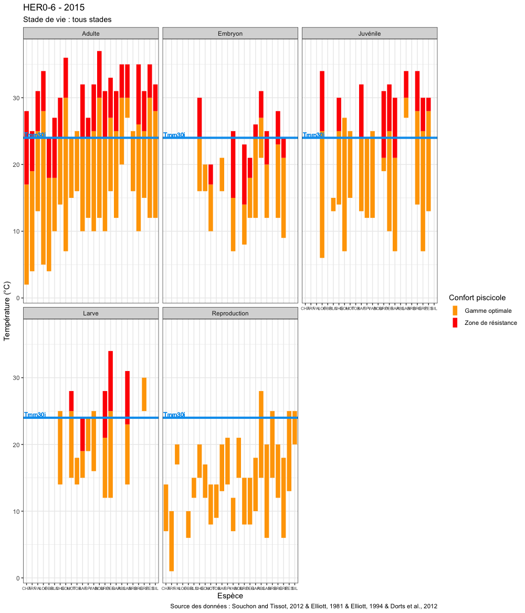

```{r couleurtexte, echo=FALSE}
colorize <- function(x, color) {
  if (knitr::is_latex_output()) {
    sprintf("\\textcolor{%s}{%s}", color, x)
  } else if (knitr::is_html_output()) {
    sprintf("<span style='color: %s;'>%s</span>", color, 
      x)
  } else x
}
```
# Valorisation
<p style="text-align: justify;">
Ce chapitre contient les informations utiles à l'utilisation des différentes valorisations générées par l'outil de traitement. Un exemple de jeu de données généré par la fonction `chronique.traitement()` est téléchargeable à l'[adresse suivante](https://github.com/jbfagotfede39/notice-thermie/raw/master/data/Sortie/Exemple_sorties_outils_thermie.zip).
</p>

## Arborescence
Un dossier `Sorties` est généré à partir du traitement des données par la fonction `chronique.traitement()`, contenant :

* le récapitulatif de l'état des **capteurs** associés au données fournies, issu d'un fichier lié directement exploité ou bien après importation dans la base de données ;
* le **suivi de terrain** relatif au données fournies, issu du [fichier de suivi de terrain](#saisiesuivi) directement ou bien à travers la base de données ;
* les **données** primaires :
  - sous la forme d'[**agrégations diverses**](#agregation),
  - sous la forme d'un **rendu** dit **DCE**, sous la forme demandée localement par l'Agence de l'eau RMC et l'Office Français de la Biodiversité (agrégation des suivis en tant que tels avec des données stationnelles et de suivi de terrain) ;
* les [**résultats**](#resultats), ou métriques statistiques calculés par les outils de traitement ;
* les [**stations**](#stations) concernées par les données thermiques traitées, issues [fichier de saisie](#saisiestations) ou issues de la base de données locale ;
* de multiples [**vues**](#vues), annuelles, interanuelles et comparatives entre sites et/ou années.

## Données {#agregation}
L'ensemble des données initialement apportées à l'outil de traitement sont regroupées au sein d'un **unique fichier** `.xlsx` **par station**.

* Les **données initiales** et brutes sont disponibles dans l'onglet `ValInstantanees`, avec éventuellement leur statut de validation et leur mode d'acquisition (mesure ou estimation).
* Une **agrégation quotidienne** est proposée dans l'onglet `ValJours`, avec :
  - les valeurs minimales, médianes, moyennes et maximales, ainsi que l'amplitude en résultant,
  - la variance journalière, 
  - le nombre de mesures disponibles pour cette date,
  - la moyenne journalière cumulée à partir de la première date de la chronique. La somme des températures moyennes journalières au dessus de 0 °C, ou **somme de degrés-jours** (défini comme tel par @Allan_Streamecologystructure_1995, cité par @Tissot_Synthesetolerancesthermiques_2010), permet de comprendre la physiologie des organises aquatiques. Par conséquence, la valeur moyenne journalière disponible plus haut correspond donc aux degrés-jours de cette même journée.
* Une **agrégation mensuelle** est proposée dans l'onglet `ValMois`, avec :
  - les valeurs minimales, médianes, moyennes et maximales, ainsi que l'amplitude en résultant,
  - la variance mensuelle, 
  - le nombre de mesures disponibles pour ce mois,
  - la somme des degrés jours pour la période concernée.
* Une **agrégation** propre à l'**année biologique** (définie par défault au sein de la fonction 
`formatage.annee.biologique` comme l'année N allant du 1er octobre de l'année N-1 au 30 septembre de l'année N) est proposée dans l'onglet `ValAnneeBiol`, avec :
  - les valeurs minimales, médianes, moyennes et maximales, ainsi que l'amplitude en résultant,
  - la variance mensuelle, 
  - le nombre de mesures disponibles pour ce mois,
  - les dates et heures des valeurs instantannées minimales et maximales
  - la somme des degrés jours pour la période concernée,
  - les percentiles 10, 25, 50, 75, 90 et 90 diurnes (considéré de 8h00 à 18h00).
* Une **agrégation** sur l'**ensemble de la période concernée** pour la station est proposée dans l'onglet `ValComplet`, avec :
  - les valeurs minimales, médianes, moyennes et maximales, ainsi que l'amplitude en résultant,
  - la variance mensuelle, 
  - le nombre de mesures disponibles pour la période concernée.

<!-- Dossier `Entrées` dans le cas d'un traitement hors BDD -->

## Résultats - Indicateurs statistiques {#resultats}
Les différents indicateurs statistiques calculés sont exportés au sein du répertoire `/Sorties/Résultats/` sous différents formats : `.geojson`, `.kml` et `.xlsx`. Un fichier `Atlas_Resultats.geojson` y est également disponible, ensuite utilisé pour générer les [fiches atlas des résultats](#fichesresultats).

### Définition des acronymes
Le tableau \@ref(tab:tableauacronymes) permet d'obtenir la signification des différents acronymes utilisés pour qualifier les indicateurs statistiques calculés.

```{r tableauacronymes, echo=FALSE}
# , fig.cap="Définition des différents acronymes utilisés"
tableauacronymes <- 
  structure(list(Abréviation = c("Typemesure", "DateDPeriode", 
                                 "DateFPeriode", "IntervalleMax", "NbJpasOk", "NbJOK", "VMinI", 
                                 "dureeTotale", "VMedI", "VMoyI", "VMaxI", "VAmpliI", "VarI", 
                                 "NMesuresI", "VMoyJMinPer", "DateVMoyJMinPer", "VMoyJMedPer", 
                                 "VMoyJMoyPer", "VMoyJMaxPer", "DateVMoyJMaxPer", "AmplitudeVMoyJPer", 
                                 "VarVMoyJ", "DateMoyVMaxMoy24H", "DateFinVMaxMoy7J", "NbJ", "VMaxMoy7J", 
                                 "DateDebutVMaxMoy7J", "VMaxMoy30J", "VMaxMoy24H", "DateDebutVMaxMoy30J", 
                                 "DateFinVMaxMoy30J", "VMinAB", "DateVMinAB", "VMaxAB", "DateVMaxAB", 
                                 "Percentile10AB", "Percentile25AB", "Percentile50AB", "Percentile75AB", 
                                 "Percentile90AB", "Percentile90diurneAB", "DureeMaxEpisodesSupN", 
                                 "DateDEpisodesSupN", "DateFEpisodesSupN", "NbJEpisodesSup", "NbEpisodesSupN", 
                                 "AnneeVMM", "VMoyMoy30J", "DureeEpisodesSupN", "RSTMAJ", "TMM30j"
  ), Définition = c("Type de mesures de chroniques", "Date de Début de la Période traitée", 
                    "Date de Fin de la Période traitée", "Intervalle de temps calculé entre DateDPeriode et DateFPeriode (en jours)", 
                    "Nombre de Jours incomplets", "Nombre de Jours complets", "Valeur Minimale Instantanée", 
                    "Cohérence de la durée totale", "Valeur Médiane Instantanée", 
                    "Valeur Moyenne Instantanée", "Valeur Maximale Instantanée", 
                    "Valeur de l'Amplitude Instantanée", "Variance des valeurs Instantanées", 
                    "Nombre de mesures Instantanées", "Valeur Moyenne Journalière Minimale de la Période traitée", 
                    "Date de la Valeur Moyenne Journalière Minimale de la Période traitée", 
                    "Valeur Moyenne Journalière Médiane de la Période traitée", 
                    "Valeur Moyenne Journalière Moyenne de la Période traitée", 
                    "Valeur Moyenne Journalière Maximale de la Période traitée", 
                    "Date de la Valeur Moyenne Journalière Minimale de la Période traitée", 
                    "Valeur de l'Amplitude des Moyennes Journalières de la Période traitée", 
                    "Valeur de la Variance des Moyennes Journalières de la Période traitée", 
                    "Date (arrondie) de la Valeur Maximale Moyenne des 24 mesures instantanées les plus hautes", 
                    "Date de Fin la Période de la Valeur Maximale Moyenne des 7 jours les plus hauts", 
                    "Nombre de Jours calendaires différents de la période traitée", 
                    "Valeur Maximale Moyenne des 7 jours les plus hauts", "Date de Début la Période de la Valeur Maximale Moyenne des 7 jours les plus hauts", 
                    "Valeur Maximale Moyenne des 30 jours les plus hauts", "Valeur Maximale Moyenne des 24 mesures instantanées les plus hautes", 
                    "Date de Début la Période de la Valeur Maximale Moyenne des 30 jours les plus hauts", 
                    "Date de Fin la Période de la Valeur Maximale Moyenne des 30 jours les plus hauts", 
                    "Valeur Minimale pour l'Année Biologique traitée", "Date de la Valeur Minimale pour l'Année Biologique traitée", 
                    "Valeur Maximale pour l'Année Biologique traitée", "Date de la Valeur Minimale pour l'Année Biologique traitée", 
                    "Percentile 10 de l'Année Biologique traitée", "Percentile 25 de l'Année Biologique traitée", 
                    "Percentile 50 de l'Année Biologique traitée", "Percentile 75 de l'Année Biologique traitée", 
                    "Percentile 90 de l'Année Biologique traitée", "Percentile 90 des valeurs diurnes (08:00 à 18:00 inclus) de l'Année Biologique traitée", 
                    "Durée Maximale des Épisodes de valeurs consécutives Supérieures à N", 
                    "Date de Début de l'Épisode le plus long de valeurs consécutives Supérieures à N", 
                    "Date de Fin de l'Épisode le plus long de valeurs consécutives Supérieures à N", 
                    "Nombre de Jours présentant au moins un Épisode de valeurs consécutives Supérieures à N", 
                    "Nombre d'Épisodes de valeurs consécutives Supérieures à N", 
                    "Année de la VMaxMoy30J", "Valeur Moyenne Moyenne des 30 jours les plus hauts", 
                    "Durée totale des Épisodes de valeurs consécutives Supérieures à N", 
                    "Réseau de Suivi de la Température des Milieux Aquatiques du Jura", 
                    "Température Maximale Moyenne des 30 jours les plus chauds")), row.names = c(NA, 
                                                                                                 -51L), class = c("tbl_df", "tbl", "data.frame"))

kable(tableauacronymes, caption = "Définition des différents acronymes utilisés") # Tout affiché d'un seul bloc
# DT::datatable(tableauacronymes) # Limitation en sous vues, mais on ne peut pas avoir le tag table # https://stackoverflow.com/questions/49819892/cross-referencing-dtdatatable-in-bookdown
```

## Stations {#stations}
Les différentes stations concernées par les données traitées sont exportés au sein du répertoire `/Sorties/Stations/` sous différents formats : `.geojson`, `.kml`, `.shp` et `.xlsx`.

### Atlas QGIS
<!-- Sens des slash/antislash dans les noms de fichiers entre windows et OSX/linux -->

#### Atlas des stations {#fichesstations}
Cet atlas s'appuie sur un [modèle QGIS](https://github.com/jbfagotfede39/notice-thermie/raw/master/data/Atlas/modele_atlas_stations_chronique.qpt) et sur la table de stations contenue dans le fichier 
`/Sorties/Stations/xxxx-xx-xx_Stations.geojson`
 (projection EPSG:4326).

Il sera ensuite nécessaire de modifier quelques paramètres, après avoir défini directement dans QGIS l'aspect cartographique que l'on souhaite (fond, format des points, étiquettes, etc.) :

* couche de référence pour l'atlas,
* titre de l'atlas, en bas de page,
* localisation des logos,
* localisation des fichiers image via la formule (photo de la station),
* Modification de la mise en page en fonction des goûts de chacun.

## Figures {#vues}
Différentes figures peuvent être générées à partir des chroniques disponibles. Ces multiples représentations permettent de s'intéresser à différentes thématiques.

### Figures annuelles {#vueannuelle}

```{r vueannuelle, echo=FALSE, fig.cap="Exemple de représentation annuelle de la Sirène à Uxelles (39) - Données FDPPMA39", out.width="80%"}
knitr::include_graphics('Figures/Vues/absolu-fixe-vmm30j_thermie_SIR7-6_-_2018.png')
```
<p style="text-align: justify;">
Une vue synthétique d'une chronique annuelle est produite grâce à la fonction `chronique.figure`, dont un exemple est visible sur la figure \@ref(fig:vueannuelle). Cet outil permet de configurer légèrement le modèle de représentation de base, qui s'appuie sur l'enveloppe journalière observée (minimas et maximas) :
</p>

- **axe temporel** libre (`duree = Relatif`) ou fixé (`duree = Complet`, comme dans cet exemple) : affichage uniquement de la chronique disponible (2 mois par exemple), ou affichage intégral sur une année complète, facilitant les comparaisons même avec des jeux de données lacunaires ;
- **axe des températures** libre (`Ymin = NA` et `Ymax = NA`) ou fixé (`Ymin = -1` et `Ymax = 30`, comme dans cet exemple) : affichage uniquement de la chronique disponible sur son enveloppe réelle de valeurs, ou affichage intégral sur une enveloppe de 0 à 30°C, facilitant les comparaisons même avec des jeux de données lacunaires ;
- **VMaxMoy30J** (`Vmm30j = TRUE`) : affichage ou non de cette valeur, avec sa répartition temporelle.

<p style="text-align: justify;">
L'intégralité de ces différentes modalités sont automatiquement générées par la fonction `chronique.traitement`, seul le cas ici présenté en figure \@ref(fig:vueannuelle) est utilisé dans les fiches atlas de résultats (section \@ref(fichesresultats)).
</p>

### Figures interannuelles {#vueinterannuelleboxplot}
#### Boxplots
```{r vueinterannuelleboxplot, echo=FALSE, fig.cap="Exemple de représentation interannuelle de l'Ain à Bourg-de-Sirod (39) - Données DREAL BFC", out.width="80%"}
knitr::include_graphics('Figures/Vues/Interannuelle_thermie_AIN9-1.png')
```
<p style="text-align: justify;">
Une vue synthétique de la **tendance des températures des dix dernières années** sur une même station semble pertinente. La fonction `chronique.figure.interannuelle` permet de générer ce type de figure, dont un exemple est visible sur la figure \@ref(fig:vueinterannuelleboxplot). Différents niveaux d'informations sont contenus dans celle-ci :
</p>

- pour chaque année :
    - la distribution des mesures individuelles, sous forme de boxplot (`style = boxplot` - distribution des quartiles et des extremums) ou sous forme d'enveloppe (`style = violon` - distribution continue),
    - le nombre de journées concernée par cette distribution annuelle,
    - la moyenne journalière minimale, sous forme de point `r colorize("bleu", "blue")`,
    - la moyenne journalière maximale, sous forme de point `r colorize("rouge", "red")`,
    - la VMaxMoy30J, sous forme de point `r colorize("orange", "orange")`,
- de manière interannuelle :
    - sous l'intitulé "Instant." :
        - la valeur instantanée minimale pour l'ensemble de la chronique, sous forme de point `r colorize("bleu", "blue")`, avec l'année correspondante,
        - la valeur instantanée maximale pour l'ensemble de la chronique, sous forme de point `r colorize("rouge", "red")`, avec l'année correspondante,
    - sous l'intitulé "Vmm30j" :
        - la VMaxMoy30J annuelle minimale pour l'ensemble de la chronique, sous forme de point `r colorize("bleu", "blue")`, avec l'année correspondante,
        - la moyenne des VMaxMoy30J annuelles pour l'ensemble de la chronique, sous forme de point `r colorize("orange", "orange")`, avec l'année correspondante,
        - la VMaxMoy30J annuelle maximale pour l'ensemble de la chronique, sous forme de point `r colorize("rouge", "red")`, avec l'année correspondante

[//]: # ### Boxplot violon

#### Cumul {#vueinterannuellecumul}
```{r vueinterannuellecumul, echo=FALSE, fig.cap="Exemple de représentation annuelle cumulée du Hérisson à Menétrux-en-Joux (39) - Données FDPPMA39", out.width="80%"}

```
<p style="text-align: justify;">
La figure \@ref(fig:vueinterannuellecumul) permet de représenter les **courbes annuelles de cumul des degrés-jours**, grâce à la fonction `chronique.figure.cumul`, à partir des [données agrégées](#agregation). Il est ainsi possible d'observer les éventuelles différences de développement pouvant survenir au cours des différentes années. La même approche peut être envisagée de manière intersites, et/ou à partir d'une date initiale différente au 01/10 (début d'une année biologique).
</p>

### Figures intersites {#vueintersitescumul}
<p style="text-align: justify;">
Une représentation des **VMaxMoy30J** en fonction de la **distance à la source** et des **années de suivi** est proposée sur la figure \@ref(fig:vueintersitesd0). Les courbes ici proposées sont automatiquement générées pour chaque cours d'eau présent dans le jeu de données initial, et pour un minimum de 3 stations. Il est également possible, de manière manuelle, d'utiliser la fonction `chronique.figure.longitudinale` pour exploiter les résultats générés par `chronique.traitement` afin d'associer par exemple différents cours d'eau selon ses propres choix.
</p>

```{r vueintersitesd0, echo=FALSE, fig.cap="Exemple de représentation des VMaxMoy30J le long du Hérisson (39) - Données FDPPMA39", out.width="80%"}

```

### Figures de préférendums thermiques

```{r vueipreferendumsthermiquesadulte, echo=FALSE, fig.cap="Exemple de représentation de préférendums thermiques d'espèces piscicoles pour le stade de vie adulte avec une Tmm30j de 24°C", out.width="80%"}
knitr::include_graphics('Figures/Vues/Vue_Preferendums_thermiques_adulte.png')
```
<p style="text-align: justify;">
La température observée sur une station de suivi doit pouvoir être rapportée aux enjeux biologiques présents sur ce site. La fonction `chronique.figure.preferendums` permet de générer des représentations des plages de température de confort et de stress, dont un exemple est visible sur la figure \@ref(fig:vueipreferendumsthermiquesadulte). On peut ici observer les températures de référence admises pour le stade adulte. D'autres valeurs sont accessibles pour les stades embryon, larve, et juvénile et pour la période de reproduction (jeu de données inclus dans `data(PoissonsPreferendumsThermiques)` - @Tissot_Synthesetolerancesthermiques_2010). Il est également possible d'y afficher ou non une valeur de VMaxMoy30J. Un affichage simultané des différents stades de vie est possible, comme sur la figure \@ref(fig:vueipreferendumsthermiquestousstades).
</p>

```{r vueipreferendumsthermiquestousstades, echo=FALSE, fig.cap="Exemple de représentation de préférendums thermiques d'espèces piscicoles pour tous les stades de vie avec une Tmm30j de 24°C", out.width="80%"}

```

## Résultats

### Fiches résultats {#fichesresultats}
La production semi-automatisée de fiches mises en forme des principaux résultats annuels par station est possible à partir des différentes sorties précédemment présentées (figures, indicateurs statistiques, etc.). Un exemple de fiche (recto-verso) est visible sur la figure \@ref(fig:vueficheatlasresultats).

Cet atlas s'appuie sur un [modèle QGIS](https://github.com/jbfagotfede39/notice-thermie/raw/master/data/Atlas/modele_atlas_resultats_chronique.qpt) et sur la table de résultats contenue dans le fichier 
 `/Sorties/Résultats/Atlas_Resultats.geojson`
 (projection EPSG:4326).

Il sera ensuite nécessaire de modifier quelques paramètres, après avoir défini directement dans QGIS l'aspect cartographique que l'on souhaite (fond, format des points, étiquettes, etc.) :

* couche de référence pour l'atlas,
* titre de l'atlas, en bas des deux pages,
* localisation des logos (sur les deux pages),
* localisation des fichiers image via la formule (vue annuelle en page 1 et vue interannuelle en page 2),
* et modification de la mise en page en fonction des goûts de chacun.

Par défaut, les représentations graphiques ([vues annuelles et interannuelles](#vues)) doivent être placées dans le répertoire `/Atlas/Sorties/Vues/`.


```{r vueficheatlasresultats, echo=FALSE, fig.show="hold", fig.cap="Exemple de fiche synthétique de résultats annuels", out.width="50%"}


```
