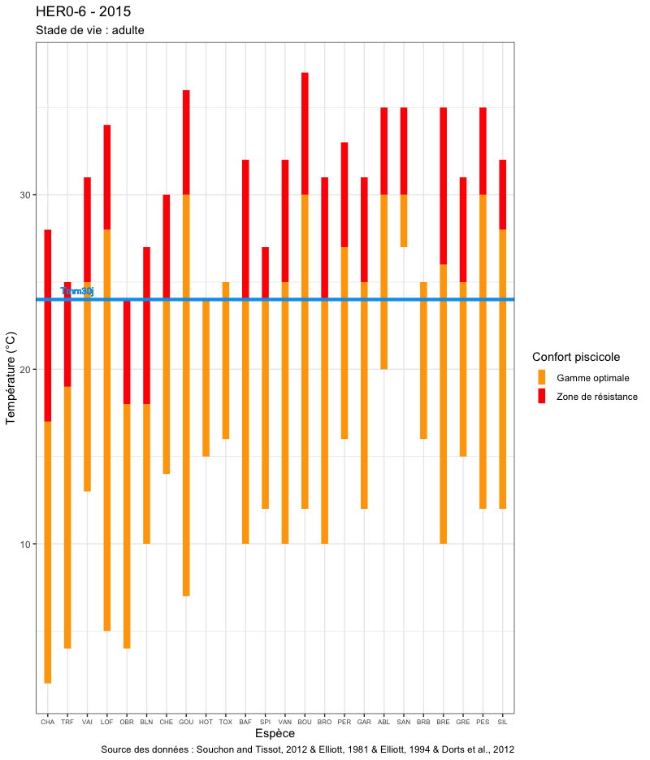

```{r couleurtexte, echo=FALSE}
colorize <- function(x, color) {
  if (knitr::is_latex_output()) {
    sprintf("\\textcolor{%s}{%s}", color, x)
  } else if (knitr::is_html_output()) {
    sprintf("<span style='color: %s;'>%s</span>", color, 
      x)
  } else x
}
```

# Valorisation
Ce chapitre contient les informations utiles à l'utilisation des différentes valorisation générées par l'outil de traitement.

[//]: # ## Suivi de terrain
[//]: # ## Capteurs
[//]: # ## Stations
[//]: # ## Format DCE

[//]: # ## Données agrégées 

## Figures
Différentes figures peuvent être générées à partir des chroniques disponibles. Ces multiples représentations permettent de s'intéresser à différentes thématiques.

[//]: # ### Figures annuelles 

### Figures interannuelles

```{r vueinterannuelleboxplot, echo=FALSE, fig.cap="Exemple de représentation interannuelle de l'Ain à Bourg-de-Sirod (39) - Données DREAL BFC", out.width="80%"}
knitr::include_graphics('Figures/Vues/Interannuelle_thermie_AIN9-1.png')
```
Une vue synthétique de la tendance des températures des dix dernières années sur une même station semble pertinente. La fonction `chronique.figure.interannuelle` permet de générer ce type de figure, dont un exemple est visible sur la figure \@ref(fig:vueinterannuelleboxplot). Différents niveaux d'informations sont contenus dans celle-ci :

- pour chaque année :
    - la distribution des mesures individuelles, sous forme de boxplot (`style = boxplot` - distribution des quartiles et des extremums) ou sous forme d'enveloppe (`style = violon` - distribution continue),
    - le nombre de journées concernée par cette distribution annuelle,
    - la moyenne journalière minimale, sous forme de point `r colorize("bleu", "blue")`,
    - la moyenne journalière maximale, sous forme de point `r colorize("rouge", "red")`,
    - la VMaxMoy30J, sous forme de point `r colorize("orange", "orange")`,
- de manière interannuelle :
    - sous l'intitulé "Instant." :
        - la valeur instantanée minimale pour l'ensemble de la chronique, sous forme de point `r colorize("bleu", "blue")`, avec l'année correspondante,
        - la valeur instantanée maximale pour l'ensemble de la chronique, sous forme de point `r colorize("rouge", "red")`, avec l'année correspondante,
    - sous l'intitulé "Vmm30j" :
        - la VMaxMoy30J annuelle minimale pour l'ensemble de la chronique, sous forme de point `r colorize("bleu", "blue")`, avec l'année correspondante,
        - la moyenne des VMaxMoy30J annuelles pour l'ensemble de la chronique, sous forme de point `r colorize("orange", "orange")`, avec l'année correspondante,
        - la VMaxMoy30J annuelle maximale pour l'ensemble de la chronique, sous forme de point `r colorize("rouge", "red")`, avec l'année correspondante

[//]: # ### Figures intersites

### Figures de préférendums thermiques

```{r vueipreferendumsthermiquesadulte, echo=FALSE, fig.cap="Exemple de représentation de préférendums thermiques d'espèces piscicoles pour le stade de vie adulte avec une Tmm30j de 24°C", out.width="80%"}

```

La température observée sur une station de suivi doit pouvoir être rapportée aux enjeux biologiques présents sur ce site. La fonction `chronique.figure.preferendums` permet de générer des représentations des plages de température de confort et de stress, dont un exemple est visible sur la figure \@ref(fig:vueipreferendumsthermiquesadulte). On peut ici observer les températures de référence admises pour le stade adulte. D'autres valeurs sont accessibles pour les stades embryon, larve, et juvénile et pour la période de reproduction (jeu de données inclus dans `data(PoissonsPreferendumsThermiques)`). Il est également possible d'y afficher ou non une valeur de VMaxMoy30J. Un affichage simultané des différents stades de vie est possible, comme sur la figure \@ref(fig:vueipreferendumsthermiquestousstades).


```{r vueipreferendumsthermiquestousstades, echo=FALSE, fig.cap="Exemple de représentation de préférendums thermiques d'espèces piscicoles pour tous les stades de vie avec une Tmm30j de 24°C", out.width="80%"}
knitr::include_graphics('Figures/Vues/Vue_Preferendums_thermiques_tous_stades.png')
```

## Indicateurs statistiques
### Définition des acronymes
Le tableau \@ref(fig:tableauacronymes) permet d'obtenir la signification des différents acronymes utilisés pour qualifier les indicateurs statistiques calculés.

```{r tableauacronymes, echo=FALSE, fig.cap="Définition des différents acronymes utilisés"}
tableauacronymes <- 
  structure(list(Abréviation = c("Typemesure", "DateDPeriode", 
                                 "DateFPeriode", "IntervalleMax", "NbJpasOk", "NbJOK", "VMinI", 
                                 "dureeTotale", "VMedI", "VMoyI", "VMaxI", "VAmpliI", "VarI", 
                                 "NMesuresI", "VMoyJMinPer", "DateVMoyJMinPer", "VMoyJMedPer", 
                                 "VMoyJMoyPer", "VMoyJMaxPer", "DateVMoyJMaxPer", "AmplitudeVMoyJPer", 
                                 "VarVMoyJ", "DateMoyVMaxMoy24H", "DateFinVMaxMoy7J", "NbJ", "VMaxMoy7J", 
                                 "DateDebutVMaxMoy7J", "VMaxMoy30J", "VMaxMoy24H", "DateDebutVMaxMoy30J", 
                                 "DateFinVMaxMoy30J", "VMinAB", "DateVMinAB", "VMaxAB", "DateVMaxAB", 
                                 "Percentile10AB", "Percentile25AB", "Percentile50AB", "Percentile75AB", 
                                 "Percentile90AB", "Percentile90diurneAB", "DureeMaxEpisodesSupN", 
                                 "DateDEpisodesSupN", "DateFEpisodesSupN", "NbJEpisodesSup", "NbEpisodesSupN", 
                                 "AnneeVMM", "VMoyMoy30J", "DureeEpisodesSupN", "RSTMAJ", "TMM30j"
  ), Définition = c("Type de mesures de chroniques", "Date de Début de la Période traitée", 
                    "Date de Fin de la Période traitée", "Intervalle de temps calculé entre DateDPeriode et DateFPeriode (en jours)", 
                    "Nombre de Jours incomplets", "Nombre de Jours complets", "Valeur Minimale Instantanée", 
                    "Cohérence de la durée totale", "Valeur Médiane Instantanée", 
                    "Valeur Moyenne Instantanée", "Valeur Maximale Instantanée", 
                    "Valeur de l'Amplitude Instantanée", "Variance des valeurs Instantanées", 
                    "Nombre de mesures Instantanées", "Valeur Moyenne Journalière Minimale de la Période traitée", 
                    "Date de la Valeur Moyenne Journalière Minimale de la Période traitée", 
                    "Valeur Moyenne Journalière Médiane de la Période traitée", 
                    "Valeur Moyenne Journalière Moyenne de la Période traitée", 
                    "Valeur Moyenne Journalière Maximale de la Période traitée", 
                    "Date de la Valeur Moyenne Journalière Minimale de la Période traitée", 
                    "Valeur de l'Amplitude des Moyennes Journalières de la Période traitée", 
                    "Valeur de la Variance des Moyennes Journalières de la Période traitée", 
                    "Date (arrondie) de la Valeur Maximale Moyenne des 24 mesures instantanées les plus hautes", 
                    "Date de Fin la Période de la Valeur Maximale Moyenne des 7 jours les plus hauts", 
                    "Nombre de Jours calendaires différents de la période traitée", 
                    "Valeur Maximale Moyenne des 7 jours les plus hauts", "Date de Début la Période de la Valeur Maximale Moyenne des 7 jours les plus hauts", 
                    "Valeur Maximale Moyenne des 30 jours les plus hauts", "Valeur Maximale Moyenne des 24 mesures instantanées les plus hautes", 
                    "Date de Début la Période de la Valeur Maximale Moyenne des 30 jours les plus hauts", 
                    "Date de Fin la Période de la Valeur Maximale Moyenne des 30 jours les plus hauts", 
                    "Valeur Minimale pour l'Année Biologique traitée", "Date de la Valeur Minimale pour l'Année Biologique traitée", 
                    "Valeur Maximale pour l'Année Biologique traitée", "Date de la Valeur Minimale pour l'Année Biologique traitée", 
                    "Percentile 10 de l'Année Biologique traitée", "Percentile 25 de l'Année Biologique traitée", 
                    "Percentile 50 de l'Année Biologique traitée", "Percentile 75 de l'Année Biologique traitée", 
                    "Percentile 90 de l'Année Biologique traitée", "Percentile 90 des valeurs diurnes (08:00 à 18:00 inclus) de l'Année Biologique traitée", 
                    "Durée Maximale des Épisodes de valeurs consécutives Supérieures à N", 
                    "Date de Début de l'Épisode le plus long de valeurs consécutives Supérieures à N", 
                    "Date de Fin de l'Épisode le plus long de valeurs consécutives Supérieures à N", 
                    "Nombre de Jours présentant au moins un Épisode de valeurs consécutives Supérieures à N", 
                    "Nombre d'Épisodes de valeurs consécutives Supérieures à N", 
                    "Année de la VMaxMoy30J", "Valeur Moyenne Moyenne des 30 jours les plus hauts", 
                    "Durée totale des Épisodes de valeurs consécutives Supérieures à N", 
                    "Réseau de Suivi de la Température des Milieux Aquatiques du Jura", 
                    "Température Maximale Moyenne des 30 jours les plus chauds")), row.names = c(NA, 
                                                                                                 -51L), class = c("tbl_df", "tbl", "data.frame"))

# kable(tableauacronymes, caption = "Définition des différents acronymes utilisés") # Tout affiché d'un seul bloc
DT::datatable(tableauacronymes) # Limitation en sous vues, mais on ne peut pas avoir le tag table # https://stackoverflow.com/questions/49819892/cross-referencing-dtdatatable-in-bookdown
```

## Atlas QGIS
<!-- Sens des slash/antislash dans les noms de fichiers entre windows et OSX/linux -->

### Atlas des stations 
Cet atlas s'appuie sur le modèle QGIS 
`/Atlas/modèle_atlas_stations_chronique.qp`
 et sur la table de stations contenue dans le fichier 
`/Sorties/Stations/xxxx-xx-xx_Stations.geojson`
 (projection EPSG:4326).

Il sera ensuite nécessaire de modifier quelques paramètres, après avoir défini directement dans QGIS l'aspect cartographique que l'on souhaite (fond, format des points, étiquettes, etc.) :

* couche de référence pour l'atlas,
* titre de l'atlas, en bas de page,
* localisation des logos,
* localisation des fichiers image via la formule (photo de la station),
* Modification de la mise en page en fonction des goût de chacun.


### Atlas des résultats
Cet atlas s'appuie sur le modèle QGIS
`/Atlas/modèle_atlas_résultats_chronique.qpt`
 et sur la table de résultats contenue dans le fichier 
 `/Sorties/Résultats/Atlas_Résultats.geojson`
 (projection EPSG:4326).

Il sera ensuite nécessaire de modifier quelques paramètres, après avoir défini directement dans QGIS l'aspect cartographique que l'on souhaite (fond, format des points, étiquettes, etc.) :

* couche de référence pour l'atlas,
* titre de l'atlas, en bas des deux pages,
* localisation des logos (sur les deux pages),
* localisation des fichiers image via la formule (vue annuelle en page 1 et vue interannuelle en page 2),
* Modification de la mise en page en fonction des goût de chacun.
